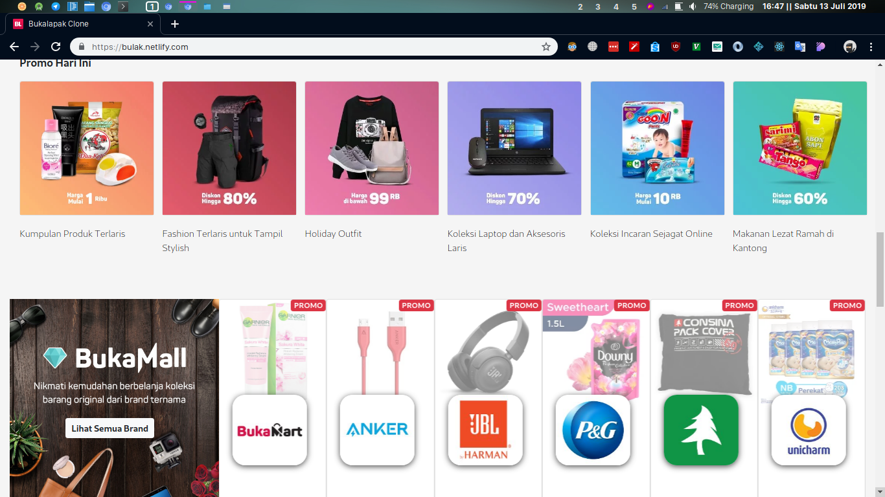

## :octocat: Bukalapak Clone
[](#contributors)


[](https://bulak.netlify.com)

Clone dari website Bukalapak, dibuat dengan ReactJS, ExpressJS, dan MySql sebagai datanya.

### Cara menjalankan

1. Clone repo ini 
   ```
   $ git clone https://github.com/Drzaln/Bukalapak-Clone.git
   ```
2. Install depedencies di folder bukalapak dan fakeAPI
   ```
   $ cd bukalapak && npm i
   ```
3. Masuk ke direktori dan jalankan bukalapak
   ```
   $ node app.js
   ```

cheers~ :beers:
## Contributors ✨

Thanks goes to these wonderful people ([emoji key](https://allcontributors.org/docs/en/emoji-key)):

<!-- ALL-CONTRIBUTORS-LIST:START - Do not remove or modify this section -->
<!-- prettier-ignore -->
<table>
  <tr>
    <td align="center"><a href="https://github.com/rizal271"><br /><sub><b>Rizal Rohman Abdul Dzalil</b></sub></a><br /><a href="#infra-rizal271" title="Infrastructure (Hosting, Build-Tools, etc)">🚇</a></td>
    <td align="center"><a href="https://github.com/rezhariansyah"><br /><sub><b>Rezha Riansyah R.</b></sub></a><br /><a href="#infra-rezhariansyah" title="Infrastructure (Hosting, Build-Tools, etc)">🚇</a></td>
  </tr>
</table>

<!-- ALL-CONTRIBUTORS-LIST:END -->

## Screnshots :beers:


